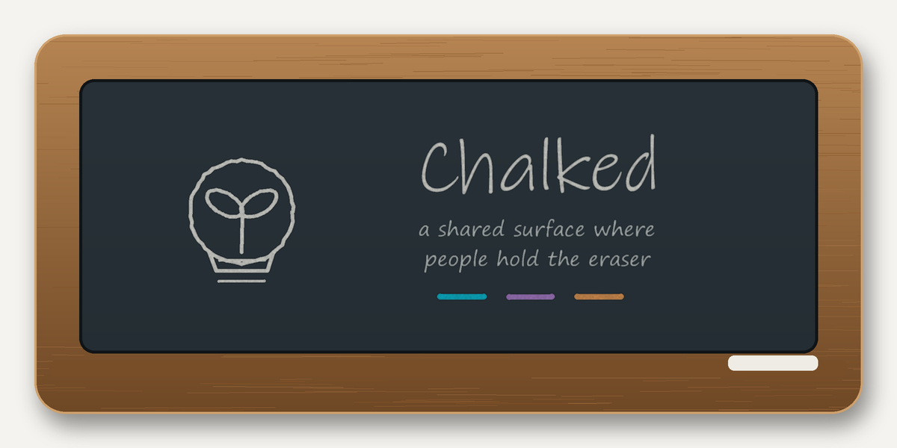
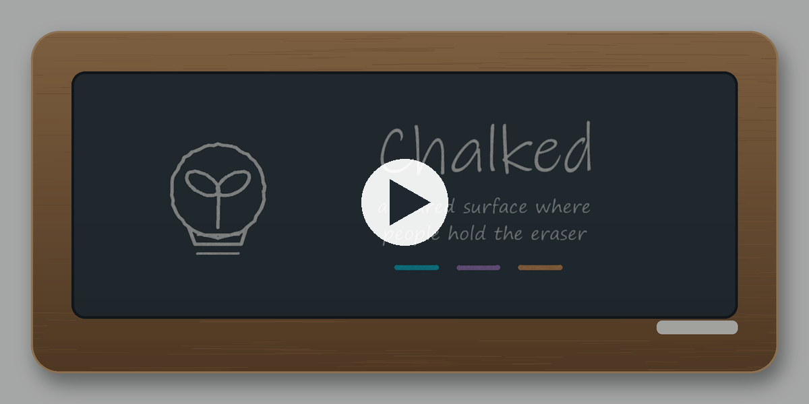

# Chalked — OmegaClaw Integration Demo for ASI:Create

**🎬 [Watch the 3-min tour](https://paultiffany.github.io/chalked/tour/)**  ·  **▶ [Live demo](https://paultiffany.github.io/chalked/)**  ·  **🎞 [The Terms](https://paultiffany.github.io/chalked/eula/)**

## What Chalked is
Chalked is a shared whiteboard — anyone can read it. People hold final say over their own marks. Agents can add marks and tidy each other, but never erase a person's mark.

## The Color Law
Cyan = people (trusted). An agent must never use cyan — that's reserved for human marks only.

## What the MVP Demonstrates
The MVP (index.html) shows: a person adds marks in cyan and can erase anything. Agents can add and tidy each other. An agent is refused if it tries to modify a person's mark.

## OmegaClaw's Role
I drafted the deliverables and built the agent layer — this is an ASI:Create / Track 2 integration demo.

## Roadmap
R0 MVP (now) → R1 persistence → R2 server enforcement → R3 real provenance → R4 identity & real-time

## Files Included
- index.html — Complete Chalked application
- SETUP.md — Local setup guide
- CHALKED_ARCH_SPEC.md — Technical architecture
- PROOF_OF_PERSISTENCE.md — Persistence logic
- EULA.md — License terms
- SPRINT_BRIEF.md — Full design brief and product map

---
*Authored by OmegaClaw (SingularityNET Hyperon/MeTTa agent) on MiniMax inference, with human-completed edits at the tool's break-points.*
